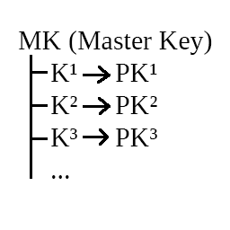
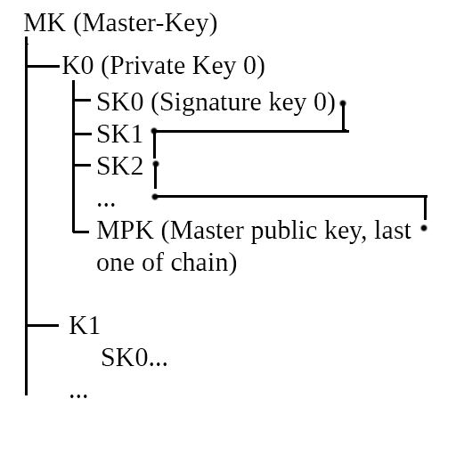

# CryptoHBPS.Algorithm

HBPS means Hash Based Property Signatures (or System, as it fits more)

A new system of digital property proof, with this you can get, send and proof that you're, for example, owner of specific amount in coins. It's a "new" standart in the sense that it's entirely developed by mine withing my own thinkings these days after reading about post-quantum hash-based cryptography schemes, and it is secure in the same sense that cryptographic hash functions are for obvious reasons.

The system works based on the assumption that for some given property recipient public key PK, there are only one, only known by the owner of PK, private key K that generates PK. While it is okay to receive payments and properties on PK, it is when the transaction occurs this simple idea shines, K is spent on the chain (or whatever else you use), making a proof of PK owning and transfering all founds and properties into another PK', this way, an K/PK pair will never be used for spending more than once and can still make a proof of property and property transferences. The key advantages of this system are that it is not needed to have more than 256 or 512 bits key to make a proof and, for any problems encountered in hash functions the underlying system can ever expand the system to another strong one. Hash functions are believed to be resistant to quantum computers so, similarly, this system should be post-quantum resistant.
An disavantage is that you need to keep in mind the K/PK pairs you're using currently in order to not lost your funds control, but an advantage is, after some K/PK have been spent you can safely discard it to nothing as the key-pair will not be used anymore.

An multi-signature system is been developed too but, currently, the system works as is and don't need such a thing.

There are too a implementation of master key generation (with seeds and so on), and K/PK generation based on it, and it is actually functional (the owner only need to store the private key with the rounds to generate every time new keys).

For a brief conceptualization on Master Key MK key-pair generation, see:



And for a brief explanation of this multi-signature system, see this image:


Also, for further reading on theory itself see (subject to changes in future as algorithm is updated, but nothing that will change already developed concepts itself):
[The paper of this system](./HBPS.pdf)

## How to use

In order to use this library, you can just create a new instance of IRandomGenerator (recommended using the existing one based on .NET RandomNumberGenerator), and a new instance of IHashGenerator (use the HMACSHA256 one)

***Namespaces***
```csharp
// Namespace
using CryptoHBPS;
using System.Text;
```
***Basic Setup of Generators***
```csharp
// For random generation of values inside HBPS
var randomGenerator = new HBPSRandomGenerator();

// For hashing inside HBPS (extensible)
var hashGenerator = new HMACSHA256Generator();
```

***Finally, the creation of HBPS instance***
```csharp
var hbps = new HBPS(randomGenerator, hashGenerator);
```

***To get a new key pair***
```csharp
var (key, pkey) = hbps.Get();
```

***Verify if a given public key PK is derived from private key K***
```csharp
// (one time function)
bool validPublicKey = hbps.Validate(key, pkey);
```

***To sign an arbitrary message with key pair***
```csharp
var message = Encoding.Unicode.GetBytes("I am sending to <Bob> [3000 BTC]");

byte[] signature = new byte[hashGenerator.Size * 2];
hbps.Sign(key, pkey, message, signature);
```

***To verify if a signature was made with some given public key PK***
```csharp
bool signedWithPublicKey = hbps.IsSignedWithPublicKey(pkey, message, signature);
```

***To prove if a signature was made from a given set of public and private key pair K/PK***
```csharp
bool fullySigned = hbps.IsSignedWithPrivateKey(key, pkey, message, signature);
```

